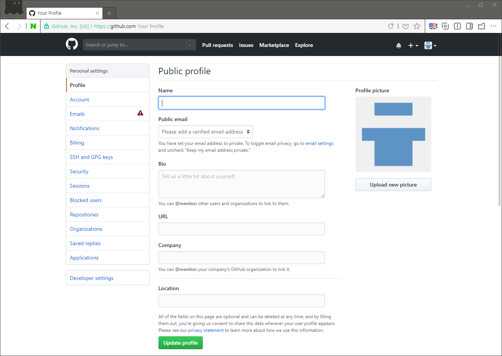
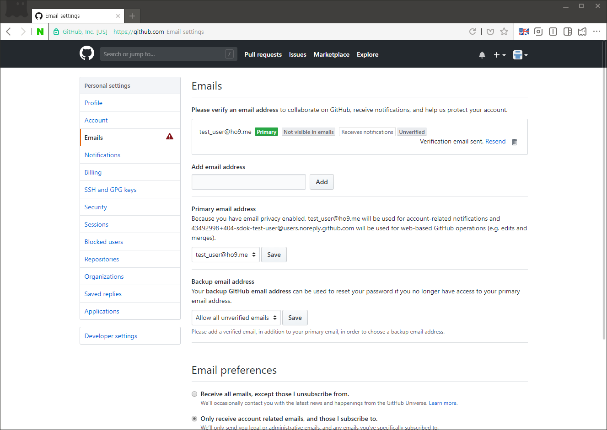
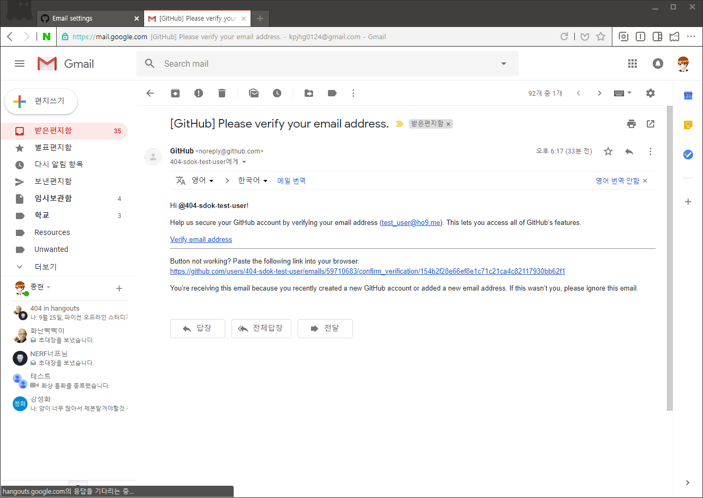
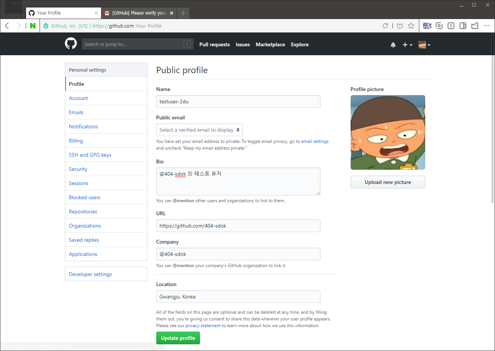
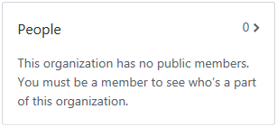
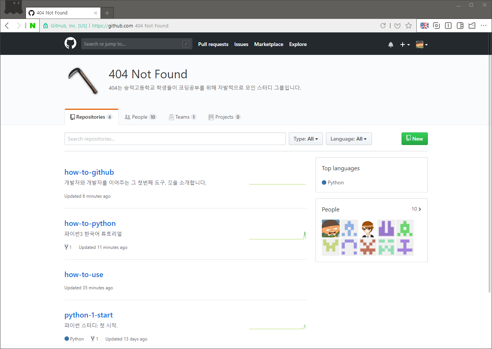

소셜 기능 - 프로필 설정
====

깃허브는 개발자 도구이지만, 여러가지 소셜 기능이 추가되어 있습니다.

하지만 깃허브를 처음 시작한 사람들은 아무도 소셜 기능을 사용하고 있지 않아, 이 부분에 대해서도 설명이 필요할 것 같습니다.


당장 우리 그룹을 보더라도 소셜 기능을 사용하고 있는 유저는 한명뿐입니다. 나머지는 모두들 기본 프로필 사진을 사용하고 별도의 이름을 지정하지 않았습니다. 슬프네요.

# 개인 프로필 설정

처음 만든 계정의 프로필 페이지입니다. 우측 상단 프로필 사진을 눌러 ```Your Profile```을 통해 접근하거나 ```https://github.com/(아이디)``` 주소로 바로 접근할 수 있습니다.

온갖 안내가 우리를 반기지만, 우리는 ```Add a bio``` 밑에 위치한 ```Edit profile``` 버튼을 눌러 프로필 설정에 접근합니다. 오른쪽 상단의 프로필 사진을 눌러 ```Settings``` 메뉴를 통해 접근할 수도 있습니다.


공개 프로필을 편집할 수 있는 페이지가 등장했습니다. 하지만, 왼쪽 탭의 Emails에 나타난 경고 표시가 거슬립니다.


이메일 주소가 실존하는것인지 다시한번 인증하면서 이미 인증 메일을 보냈다고 합니다. 만약 찾을수 없다면 ```Resend```를 눌러 다시 받을 수 있습니다.


아! 가입하자마자 와있었네요! ```Verify email address```나 아래 긴 링크를 통해 이메일 인증을 진행하고 다시 깃허브 프로필 설정으로 돌아갑시다.


깃허브 프로필을 편집해줍시다.

```
Name            : 프로필에 별도로 표시될 이름. (닉네임)
Public Email    : 전체 공개할 이메일.
Bio             : 상태메시지.
URL             : 개인 홈페이지 주소.
Company         : 자신을 대표할 집단.
Location        : 주소.
```

이렇게 개인 프로필 설정이 모두 끝났습니다.

# 그룹 프로필 설정
이제 그룹 프로필을 설정해 봅시다.



사실 그룹 프로필은 권한이 있는 사람만 설정할 수 있습니다. 여기서 그룹 프로필을 언급한 이유는 **비로그인 상태로 그룹 프로필에 접근하면 People에 집단에 소속된 사람이 나타나지 않도록** 기본 설정이 되어 있기 때문에 이를 수정하게 하기 위해서입니다.


모두가 집단에 소속된 사실을 프로필에 표시하지 않도록 설정했을때 이렇게 슬픈일이 발생합니다.