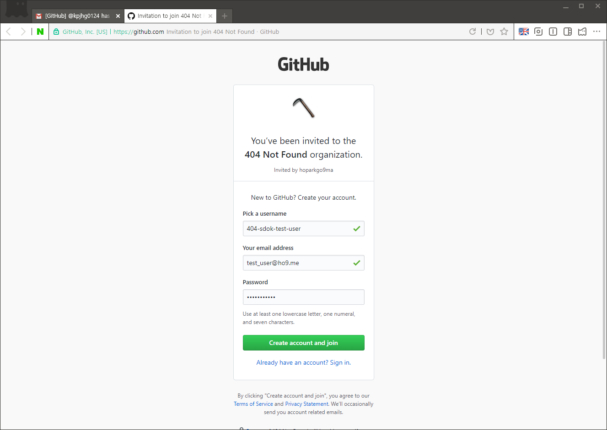
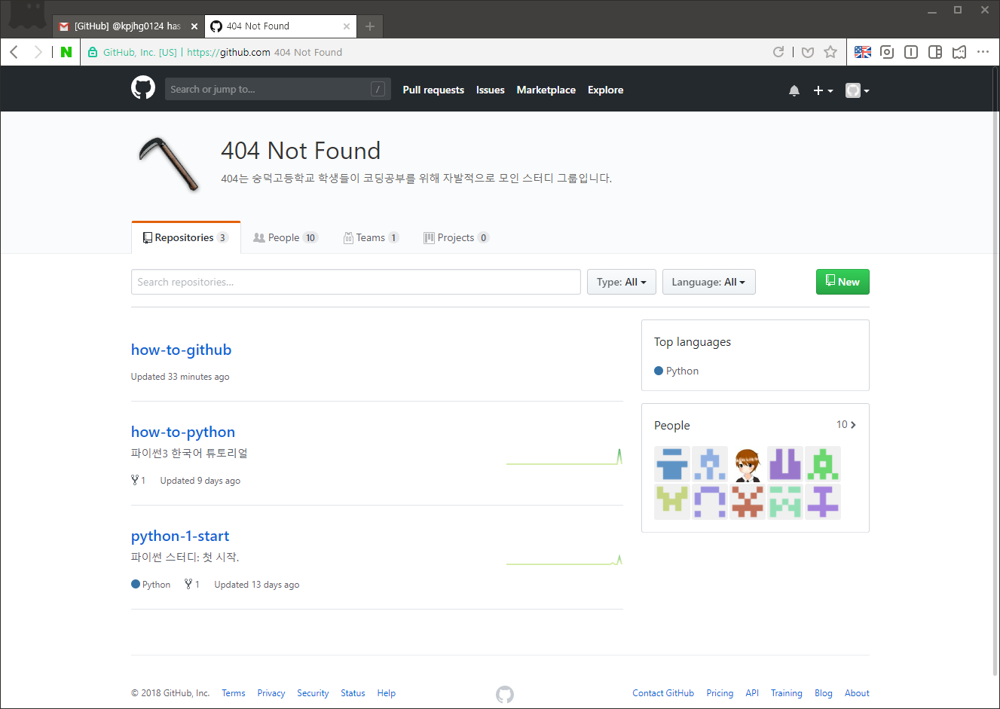

소셜 기능 - 회원가입
====

깃허브의 회원 가입 절차는 매우 간단합니다. 사실 외국 사이트들의 회원 가입 절차는 너무나 간단하지만, 깃허브는 차원이 다릅니다.

하지만, 너무나도 간단한 나머지 회원가입을 해놓고 아무도 자신이 회원가입한 줄 모르고 있습니다. 여기서 다시한번 톺아봅시다.


여기, 한 그룹으로부터 깃허브 초대가 왔습니다.

```
@kpjhg0124가 당신을 @404-sdok 그룹으로 초대했습니다.

@kpjhg0124가 당신을 깃허브의 @404-sdok 그룹으로 초대했습니다.
https://github.com/404-sdok에 접속해 @404-sdok의 프로필을 확인하세요.

@404-sdok 가입하기

깃허브가 처음이신가요?
깃허브는 사람들이 소프트웨어를 만드는 방법 그 자체입니다. 수백만의 개발자가
깃허브를 자신의 프로젝트를 만들어 나가는데 사용하거나, 그들의 사업에 이용하거나,
오픈소스 프로젝트를 함께 이끌어 나가는데 사용하고 있습니다. 더 알아보기

참고: 이 초대는 test_user@ho9.me를 위한 것입니다. 당신이 이 초대의 대상이
아니라면, 메일을 무시해도 좋습니다.

위의 "Join @404-sdok"가 제대로 작동하지 않나요? 아래 링크로 접속해 보세요.
(링크)

당신은 @kpjhg0124 의 초대를 받고 있습니다.
```

```Join @404-sdok```나 아래의 긴 링크를 통해서 깃허브에 가입하도록 합시다.


이 창은 로그인 창 같지만 놀랍게도 회원가입 창 입니다.
```
Pick a username     : 아이디
Your email address  : 이메일 주소
Password            : 비밀번호
```
해당하는 내용을 입력합니다.


username을 닉네임으로 이해하는 경우가 많은데, 영미권에서 username은 아이디를 의미하기도 합니다. 이곳에서도 아이디를 의미하며, 닉네임은 이후 nickname 으로 별도로 지정할 수 있으니 편하게 평소 쓰는 아이디를 넣어줍시다.


```Create an account``` 버튼을 눌러줍니다. 이메일 인증 과정 페이지인데, 이메일을 통해 초대를 받았기 때문에 별도 인증이 생략되어 체크 기호가 뜨는 것입니다.


그룹의 프로필 페이지가 나타납니다.

이것으로 가입이 끝났습니다. 놀랍게도 이게 끝입니다.

수백만 개발자의 세계에 발을 들여놓은 여러분, 환영합니다.